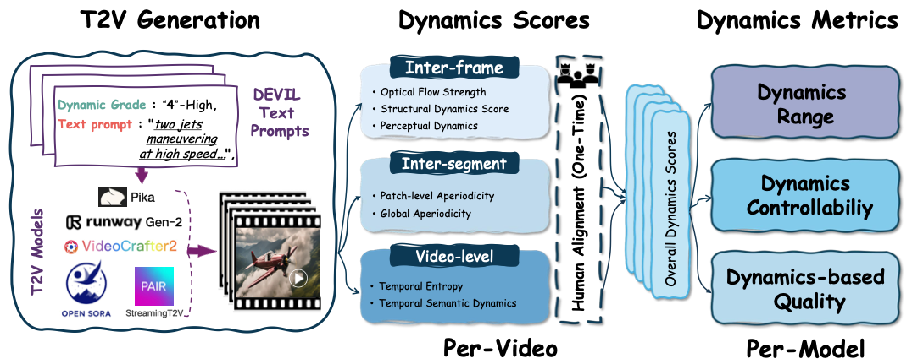

# DEVIL Protocol
Official implementation of Evaluating dynamics capability of T2V generation models with DEVIL protocols (NeurIPS 2024)
[](https://arxiv.org/abs/2407.01094)
# Table of Contents
- [DEVIL Protocol](#devil-protocol)
- [Table of Contents](#table-of-contents)
- [Overview](#overview)
- [Installation](#installation)
- [Model Weights](#model-weights)
- [Gemini API Key](#gemini-api-key)
- [Usage](#usage)
- [Acknowledgement](#acknowledgement)
- [Citation](#citation)

# Overview

Comprehensive and constructive evaluation protocols play an important role in the development of sophisticated text-to-video (T2V) generation models.
Existing evaluation protocols primarily focus on temporal consistency and content continuity, yet largely ignoring the dynamics of video content.
Dynamics are an essential dimension for measuring the visual vividness and the honesty of video content to text prompts.
In this study, we propose an effective evaluation protocol, termed DEVIL, which centers on the dynamics dimension to evaluate T2V models.
For this purpose, we establish a new benchmark comprising text prompts that fully reflect multiple dynamics grades, and define a set of dynamics scores corresponding to various temporal granularities to comprehensively evaluate the dynamics of each generated video.
Based on the new benchmark and the dynamics scores, we assess T2V models with the design of three metrics: dynamics range, dynamics controllability, and dynamics-based quality.
Experiments show that DEVIL achieves a Pearson correlation exceeding 90% with human ratings, demonstrating its potential to advance T2V generation models. 


# Installation
```
cd geminiplayground 
pip install -e .
cd ..
pip install -r requirements.txt
```
# Model Weights
Download model weights from [Google Drive(Still Uploading)](https://drive.google.com/drive/folders/1VEMOOOLyw_7fumLpmL5AiMEEok-tZjsD?usp=sharing) or [Baidu Disk(extract code: 2gjp)](https://pan.baidu.com/s/1CXwCRRWWvFV-WpZL18ekBQ?pwd=2gjp) and put them in the **```model_weights```** directory.

# Gemini API Key
The ```naturalness``` metric relies on the Gemini 1.5 Pro model. So please turn to [Gemini](https://ai.google.dev/gemini-api/docs/api-key') to obtain your gemini_api_key before evaluating your model.

# Usage

- Generate videos with prompts provided in ```prompts/```, all videos should be named with dynamics prefix, e.g. 'high_xxx.mp4'
- Evalute videos dynamics and model metrics:
  ```
  bash eval_dynamics.dist.sh \
    --video_dir dir_to_your_videos \
    --gemini_api_key your_gemini_api_key \
    --num_gpus 8
  ```

# Acknowledgement
We gratefully acknowledge the following repositories, whose resources were instrumental in our evaluation: 
[Vbench](https://github.com/Vchitect/VBench), [EvalCrafter](https://evalcrafter.github.io/), [geminiplayground](https://github.com/haruiz/geminiplayground), and [ViClip](https://github.com/OpenGVLab/InternVideo). 
Our sincere thanks to the contributors of these projects.


# Citation
Please consider citing our paper in your publications if the project helps your research.
```
@inproceedings{liao2024evaluation,
  title={Evaluation of text-to-video generation models: A dynamics perspective},
  author={Liao, Mingxiang and Lu, Hannan and Zhang, Xinyu and Wan, Fang and Wang, Tianyu and Zhao, Yuzhong and Zuo, Wangmeng and Ye, Qixiang and Wang, Jingdong},
  booktitle =  {Neural Information Processing Systems},
  year={2024}
}
```